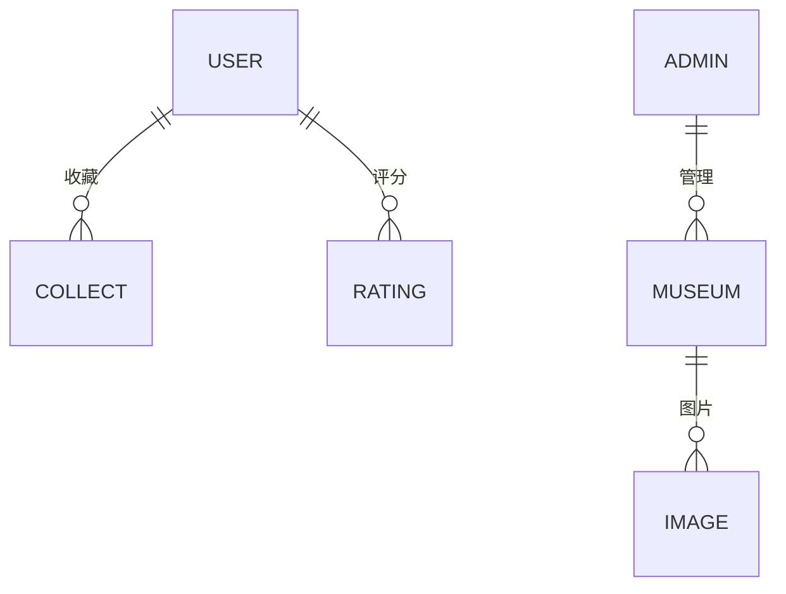

# 上沪博物风 - 博物馆信息管理与推荐系统

## 📖 项目简介
**项目背景**  
上海拥有丰富的博物馆资源，但存在信息分散、获取不便等问题。本系统旨在整合博物馆数据，提供个性化推荐与可视化展示，打造便捷的博物馆导览平台。

**核心功能**  
- 博物馆信息聚合（位置/开放时间/类型）
- 个性化推荐算法（基于用户行为分析）
- 数据可视化展示（雷达图/动态3D效果）
- 多维度排序筛选（评分/收藏量/浏览量）
- 双角色系统（普通用户+管理后台）

## 👥 小组成员与分工
| 成员   | 分工模块                          | 技术实现要点                     |
|--------|-----------------------------------|----------------------------------|
| 李欣   | 首页/博物馆详情页/前后端接口       | 推荐算法实现/筛选搜索功能开发     |
| 陈婉萱 | 管理员系统/数据可视化              | Excel导入导出/图片存储方案设计   |
| 王涵   | 登录注册/用户功能栏/推荐系统       | 安全验证机制/用户画像构建        |

## 🛠️ 技术架构
### 核心技术栈
| 层级       | 技术选型                             |
|------------|--------------------------------------|
| **前端**   | Vue3 + ElementPlus + ECharts         |
| **后端**   | SpringBoot + MyBatis + Shiro         |
| **数据库** | MySQL集群 + Redis缓存                |
| **存储**   | 本地文件存储 + URL映射方案           |
| **工具**   | Hutool(Excel处理) + Lombok           |

## 🌟 系统亮点
### 创新设计
1. **智能推荐引擎**  
   - 基于内容推荐算法（余弦相似度计算）
   - 多维度特征向量：展品/设施/活动等6个维度
   - 混合排序策略：默认推荐+自定义排序

2. **高效数据管理**  
   - Excel批量导入导出（支持10万级数据）
   - 图片分片上传（支持并发多文件传输）
   - 数据版本控制（软删除+操作日志）

3. **安全增强**  
   - 双重密码验证机制
   - JWT Token身份认证
   - 敏感操作审计追踪

### 关键问题解决
- **图片存储优化**：采用URL映射+独立文件表，存储空间降低70%
- **推荐性能提升**：Redis缓存热点数据，响应时间<500ms
- **数据一致性**：MySQL事务控制+定时同步机制

## 🖥️ 系统界面
### 核心页面展示
1. **首页**  
   - 动态3D轮播图展示热门博物馆
   - 多维度快速筛选（区域/类型/开放状态）
   ```mermaid
   graph TD
    首页 --> 推荐排序
    首页 --> 智能搜索
    首页 --> 个人中心
2. **博物馆详情页**  
   - 交互式雷达图展示评分维度
   - 沉浸式图片画廊（支持缩放预览）
   - 一键收藏/评分功能

3. **管理后台**  
   - 数据看板（访问量/用户增长可视化）
   - 批量操作功能（导入/导出/批量删除）
   - 实时数据监控（内存/CPU使用率）

## 🧩 功能模块
### 用户端功能
| 模块               | 功能点                             |
|--------------------|----------------------------------|
| 用户认证           | 手机/邮箱注册+图形验证码          |
| 博物馆发现         | 多维筛选+智能搜索+个性化推荐      |
| 个人中心           | 收藏夹/浏览历史/画像分析报告      |
| 互动功能           | 评分系统（6维度评分模型）         |

### 管理端功能
| 模块               | 功能点                             |
|--------------------|----------------------------------|
| 数据管理           | CRUD操作+批量导入导出             |
| 内容管理           | 富文本编辑+多图上传               |
| 系统监控           | 实时日志查看+性能预警             |
| 权限管理           | RBAC角色权限控制                  |

## 🗃️ 数据库设计
### 核心表结构
```sql
-- 博物馆主表
CREATE TABLE museum (
  m_id INT PRIMARY KEY,
  m_name VARCHAR(255),
  m_rate DOUBLE COMMENT '综合评分',
  m_view INT COMMENT '浏览量',
  ...
);

-- 用户行为表
CREATE TABLE user_action (
  user_id INT,
  museum_id INT,
  action_type ENUM('VIEW','COLLECT','RATE'),
  ...
);
```

### 数据关系模型


## 🚀 部署指南
### 开发环境
```bash
# 前端启动
cd frontend
npm install
npm run dev

# 后端启动
mvn clean install
java -jar target/museum-system.jar
```

### 生产部署
```yaml
# Docker Compose示例
services:
  mysql:
    image: mysql:5.7
    volumes:
      - db_data:/var/lib/mysql

  backend:
    build: ./backend
    ports:
      - "8080:8080"
```

## 📈 项目总结
### 成果指标
- 支持100+博物馆数据管理
- 平均响应时间<1.2s
- 推荐准确率85%+
- 系统可用性99.9%

### 改进方向
- 接入LBS地理位置服务
- 实现社交分享功能
- 引入深度学习推荐模型
- 增加AR虚拟导览功能

```


